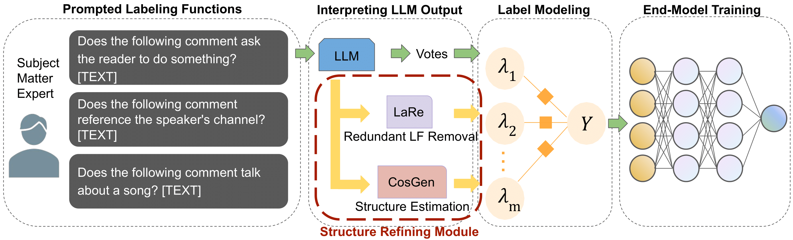

# Leveraging Large Language Models for Structure Learning in Prompted Weak Supervision
Jinyan Su*, Peilin Yu*, Jieyu Zhang, Stephen H. Bach (*: Co-first)

This repository host the code for the preliminary experiments in ENLSP-23 Workshop Paper "Structure Discovery in Prompted Weak Superviison" and full experiments in IEEE BigData 23 Paper "Leveraging Large Language Models for Structure Learning in Prompted Weak Supervision".
This paper explores a modular approach to leverage Large Language Models to obtain structural information for prompted weak supervision setup.




## Citation 

If you find our work helpful, please consider citing the following paper:
```
@misc{
    syzb2023leverage,
    title={Leveraging Large Language Models for Structure Learning in Prompted Weak Supervision}, 
    author={Jinyan Su and Peilin Yu and Jieyu Zhang and Stephen H. Bach},
    year={2023},
    booktitle = {IEEE BigData}, 
}
```


## Instructions

### Create environment and run experiments
```
conda create --name WS_env python=3.8 
conda activate WS_env
pip install -r requirements.txt

bash run.sh # run bash file
```
### Dataset Source
| Name | Task | # class | # Prompted LFs | # train | # validation | # test | source
|:--------|:---------|:------|:---|:------|:-------|:-------|:--------------------|
| Spouse | relation classification | 2 | 11 | 22254 | 2811 | 2701 | [Github repo of Snorkel tutorial](https://github.com/snorkel-team/snorkel-tutorials/tree/master/spouse)| 
| Youtube | spam clasification | 2 | 10 | 1586 | 120          | 250    | [Google drive link shared in WRENCH benchmark](https://drive.google.com/drive/folders/19p_BsGsF_JuriiQV4RB6qH3wcZXcvWGa)| 
| SMS | spam clasification | 2 | 73 | 4571 | 500          | 500    | [Github repo of Snorkel tutorial](https://github.com/snorkel-team/snorkel-tutorials/tree/master/spam)| 

### Embed the LFs
The embedding of the LFs are in the './data/' directory with the data, you can also get the embedding yourself with the following command:
```
cd get_LF_embedding/
bash run_embedding.sh
```
